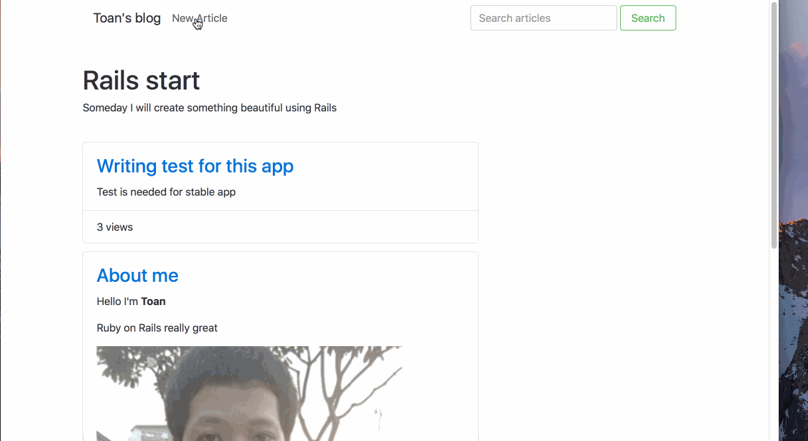

# Pre-work - vutoanblog

https://circleci.com/gh/:vtoanb/:coderschool_assigment.svg?style=shield&circle-token=:circle-token

vutoanblog is a Ruby on Rails blog application.

Submitted by: Toan Vu

Time spent: 28 hours spent in total

URL: https://toan-prework.herokuapp.com

## User Stories

The following **required** functionality is complete:

* [x] User can create a new post, formatted using the Markdown language.
* [x] User can edit an existing post.
* [x] There is one post that introduces the App Creator with name, picture.
* [x] User can delete stories, with an alert that asks the user to confirm.
* [x] User see a search form on the Posts page.
* [x] User can submit a search term to find all posts bywith titles containing the search term.

The following **optional** features are implemented:
* [x] There is a "navbar" that is responsive to window size similar to http://v4-alpha.getbootstrap.com/examples/navbar/. 
* [x] User can see how many views a post has. 
* [x] User can leave a comment on a post.
* [ ] User can add "tags" to a post, and filter posts by tag. 

The following **additional** features are implemented:
* [x] User can see how long comments has been posted
* [x] User also see how many comments has been posted

## Video Walkthrough

Here's a walkthrough of implemented user stories:

GIF created with [LiceCap](http://www.cockos.com/licecap/).

## Notes

I spend too much time on try to learn and implement authentication but receive email from coderschool memind me to done assignment,
so I make it complete first and try to improve it later.

Bootstrap 4 buggy also make me take something for fix for example delete action do not working on heroku but working under local host.

## License

    Copyright 2016 vtoanb

    Licensed under the Apache License, Version 2.0 (the "License");
    you may not use this file except in compliance with the License.
    You may obtain a copy of the License at

        http://www.apache.org/licenses/LICENSE-2.0

    Unless required by applicable law or agreed to in writing, software
    distributed under the License is distributed on an "AS IS" BASIS,
    WITHOUT WARRANTIES OR CONDITIONS OF ANY KIND, either express or implied.
    See the License for the specific language governing permissions and
    limitations under the License.
